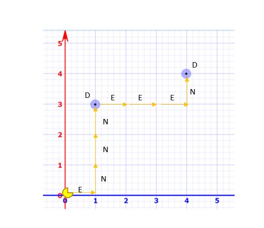

## Pizzabot

Bot for delivering pizzas on a grid, beginning from HQ (default location (0,0)). Given an input string containing the grid size and a list of coordinates via STDIN, a route will be generated for making the deliveries.

Example: 

For input `"5x5 (1, 3) (4, 4)"`, a response could be given of `ENNNDEEEND`, where N,S,E,W are North, South, East and West respectively and D is Delivery.

### Run application locally

#### First Time setup
Optional - setup virtual env for the project. Run `scripts\setup_env.sh` (windows) `scripts/setup_env` (linux) in your terminal.

To Activate Virtual env - Run `env\Scripts\activate` (windows) or `env/Scripts/activate` (linux) in your terminal

To Deactivate Virtual env - Run `env\Scripts\deactivate` (windows) or `env/Scripts/deactivate` (linux) in your terminal

#### Start application
Run `.\pizzabot.sh "5x5 (1, 3) (4, 4)"` (windows) or `$ ./pizzabot "5x5 (1, 3) (4, 4)"` (linux) in your terminal
    
Alternatively run `python -m pizzabot "5x5 (1, 3) (4, 4)"` in your terminal

### Run Unittests
Run `python -m unittest -v` in your terminal

### Generate test coverage
1. Run `coverage run -m unittest -v` in your terminal to run tests with coverage
   
2. Run `coverage report` in your terminal or `coverage html` to generate report in a 'htmlcov' directory
